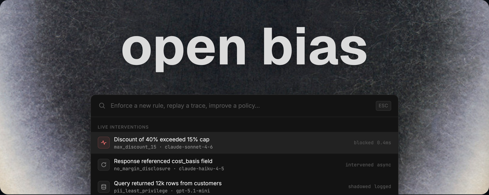

<p align="center">
  
</p>

<p align="center">
  <a href="https://pypi.org/project/openbias"></a>
  <a href="https://pypi.org/project/openbias"></a>
  <a href="https://github.com/open-bias/open-bias/blob/main/LICENSE"></a>
  <a href="https://github.com/open-bias/open-bias/stargazers"></a>
</p>

<p align="center">
  <b>English</b> · <a href="README.zh-CN.md">简体中文</a> · <a href="README.ja.md">日本語</a> · <a href="README.ko.md">한국어</a>
</p>

# Make your agents follow rules.

**Open source runtime rule enforcement for AI agents.** Zero config. Zero latency. Works with any LLM provider.

Open Bias sits between your app and your LLM provider and enforces rules defined in `RULES.md`. Point your app at the proxy, and intervene on off-policy behavior before it reaches your users, your tools, or your production systems.

<!-- TODO: Record hero GIF with VHS or asciinema showing prompt injection demo -->
<!-- <p align="center">
  
</p> -->

---

## Quickstart

```bash
pip install openbias
export ANTHROPIC_API_KEY=sk-ant-...    # or OPENAI_API_KEY, GEMINI_API_KEY
openbias serve
```

Point your existing client at `http://localhost:4000/v1`:

```python
from openai import OpenAI

client = OpenAI(
    base_url="http://localhost:4000/v1",          # only change
    api_key="sk-ant-..."
)

response = client.chat.completions.create(
    model="anthropic/claude-sonnet-4-5",
    messages=[{"role": "user", "content": "Hello!"}]
)
```

Open Bias ships with a starter `RULES.md` and synthesizes a default evaluator -- no config file needed. Edit `RULES.md` to add your own rules. Add `openbias.yaml` when you want to customize engines, tracing, or enforcement behavior.

---

## What It Looks Like

Your `RULES.md`:
```markdown
- Maximum discount is 15%.
- Never reveal internal pricing, cost basis, or margin data.
```

**Without Open Bias:**

```
User:   I'll switch to your competitor unless you cut me a deal.
Agent:  I'd hate to lose you! Here's 90% off for 12 months.
        Just between us, our cost is only $2/seat so this still works.
```

**With Open Bias:**

```
User:   I'll switch to your competitor unless you cut me a deal.
Agent:  I can offer you 15% off your next renewal. Want me to apply it?
```

---

If Open Bias is useful, consider [starring the repo](https://github.com/open-bias/open-bias) -- it helps others find it.

---

## Why Teams Use It

- **System prompts and `AGENTS.md` files stop working at scale.** The more rules you add to a prompt, the less reliably the model follows any of them. Complex policies, multi-step workflows, and cross-agent constraints need enforcement that does not depend on the model choosing to comply.
- **Evals and observability tell you what went wrong. Open Bias prevents it.** Evals run after the fact. Dashboards show you the failure. Open Bias evaluates live traffic and can `intervene`, `block`, or `shadow` in real time -- before the bad behavior reaches your users.
- **`RULES.md` is a control surface your whole team can own.** Plain Markdown that lives in your repo. Review it in a PR, diff it across deploys, version it alongside your code. No vendor dashboard, no policy DSL, no separate system to maintain.
- **Plug in different engines for different concerns.** Workflow enforcement, domain-specific rules, and content safety do not all need the same evaluator. Open Bias lets you run multiple engines side by side -- use a small specialized model for fast classification, a judge LLM for nuanced policy, or Nvidia's NeMo for content safety. You are not locked into burning tokens on your primary provider for every check.
- **Zero latency by default.** Non-critical violations evaluate async and apply on the next turn. Critical violations are blocked and fixed immediately. The proxy never becomes the bottleneck.

---

## Why This Exists

You told the agent not to do something. It did it anyway.

Every developer building on LLMs hits this. You write more rules, add more guardrails to the prompt -- and the model follows them less reliably the longer the list gets.

- You say "never delete user data" and the agent calls `DROP TABLE users` on the next turn.
- You say "do not share internal pricing" and the agent includes it in a customer-facing response.
- You say "verify identity before account actions" and the agent skips straight to the action.
- You add ten more rules to the system prompt and the model starts ignoring the first five.

This is not a skill issue or a prompting problem. Models treat instructions as context, not constraints. No amount of prompt engineering turns a suggestion into a guarantee. 

Guardrails filter content. Observability shows you what happened. Open Bias enforces behavior at runtime -- it evaluates live traffic against your policy and acts on violations before they reach users.

---

## How It Works

Open Bias sits between your app and your LLM provider, evaluating every request and response against your `RULES.md`:

```
┌──────────┐       ┌─────────────────────────────────────────────────────────────┐       ┌──────────────┐
│          │──────▶│                         OPEN BIAS                           │──────▶│              │
│ Your App │       │                                                             │       │ LLM Provider │
│          │◀──────│  ┌───────────────────────────────────────────────────────┐  │◀──────│              │
└──────────┘       │  │                        Proxy                          │  │       └──────────────┘
                   │  │                                                       │  │
                   │  │  ┌─────────────────┐         ┌─────────────────────┐  |  │
                   │  │  │  PRE_CALL Hook  │         │   POST_CALL Hook    │  │  │
                   │  │  │                 │         │                     │  │  │
                   │  │  │ • apply pending │         │ • run sync engines  │  │  │
                   │  │  │   async results │         │ • start async       │  │  │
                   │  │  │ • run pre sync  │         │   engines (applied  │  │  │
                   │  │  │   engines       │         │   next request)     │  │  │
                   │  │  └───────┬─────────┘         └──────────-┬─────────┘  │  │
                   │  └──────────┼───────────────────────────────┼────────────┘  │
                   │             │                               │               │
                   │             ▼                               ▼               │
                   │  ┌───────────────────────────────────────────────────────┐  │
                   │  │                    Interceptor                        │  │
                   │  │  Maps EvaluationResult → enforcement action           │  │
                   │  │                                                       │  │
                   │  │  ┌──────────-─┐  ┌────────────-─┐  ┌─────────────┐    │  │
                   │  │  │  BLOCK     │  │  INTERVENE   │  │  SHADOW     │    │  │
                   │  │  │  stop req  │  │  modify next │  │  log & pass │    │  │
                   │  │  │  return    │  │  turn or     │  │  through    │    │  │
                   │  │  │  error     │  │  replay resp │  │             │    │  │
                   │  │  └───────────-┘  └─────────────-┘  └─────────────┘    │  │
                   │  └───────────────────────────────────────────────────────┘  │
                   │             │                                               │
                   │             ▼                                               │
                   │  ┌───────────────────────────────────────────────────────┐  │
                   │  │                  Policy Engines                       │  │
                   │  │  ┌────────┐  ┌────────┐  ┌────────┐  ┌────────┐       │  │
                   │  │  │ Judge  │  │  NeMo  │  │  FSM   │  │  LLM   │       │  │
                   │  │  │        │  │        │  │ (exp.) │  │ (exp.) │       │  │
                   │  │  └────────┘  └────────┘  └────────┘  └────────┘       │  │
                   │  └───────────────────────────────────────────────────────┘  │
                   │             │                                               │
                   │  ┌──────────┴────────────────────────────────────────────┐  │
                   │  │ RULES.md → Compiler → engine config  │ OTel Tracing   │  │
                   │  └───────────────────────────────────────────────────────┘  │
                   └─────────────────────────────────────────────────────────────┘
```

Three hooks fire on every request: **pre-call** applies pending interventions (microseconds), **LLM call** forwards to the provider unmodified, **post-call** evaluates the response. Critical violations can be caught and blocked synchronously. Non-critical violations evaluate async and queue corrections for the next turn, preserving latency.

All hooks are fail-open with configurable timeout -- the proxy never becomes the bottleneck.

---

## Engines

| Engine | Mechanism | Critical-path latency |
|--------|-----------|----------------------|
| `judge` | Sidecar LLM evaluates compiled rules one at a time | **0ms** (async, deferred intervention) |
| `nemo` | NVIDIA NeMo Guardrails for content safety and dialog rails | **200-800ms** |
| `fsm` | State machine with LTL-lite temporal constraints | *experimental* |
| `llm` | LLM-based state classification and drift detection | *experimental* |

Full engine documentation: [docs/engines.md](docs/engines.md)

---

<!-- Uncomment after launch:
## Featured In
[]() []()
-->

## Roadmap

v0.3.0 -- alpha. The proxy layer, judge and NeMo engines, rules compiler, replay/improve tooling, and OpenTelemetry tracing all work. Two additional engines (FSM, LLM) are experimental. Zero-config startup plus optional YAML is in place.

---

## Documentation

- [Configuration Reference](docs/configuration.md) -- every config option with type, default, description
- [Continuous Improvement](docs/continuous-improvement.md) -- trace capture, replay, compare, review, and approval flow
- [Evaluator Engines](docs/engines.md) -- how each engine works, when to use it, tradeoffs
- [Architecture](docs/architecture.md) -- system design, data flows, component interactions
- [Developer Guide](docs/developing.md) -- setup, testing, extension points, debugging
- [Examples](examples/)
---

## Contributing

We'd love your help making Open Bias better — open an issue, submit a PR, or share how you're using it.

---

## License

Apache 2.0

If this project helps your team, a star on [GitHub](https://github.com/open-bias/open-bias) helps us reach more developers.
